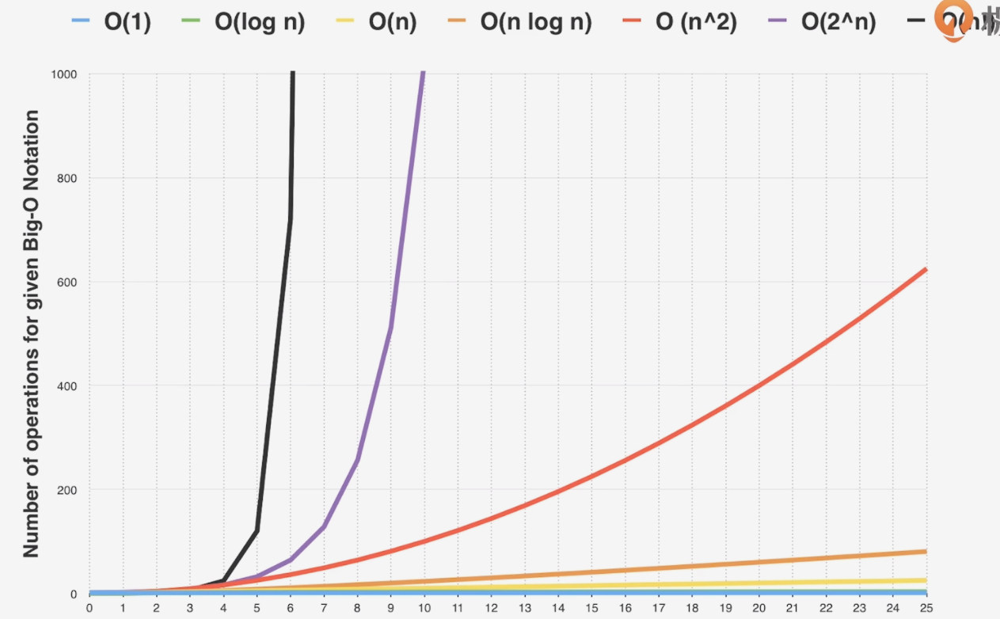
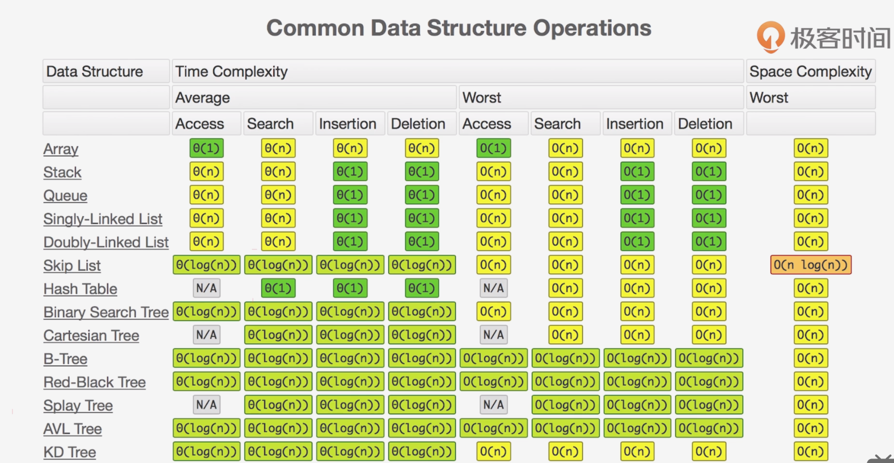

 ### 常用时间复杂度：
 * O(1): 常数复杂度
 * O(log n): 对数复杂度
 * O(n): 线性时间复杂度
 * O(n^2): 平方
 * O(n^3): 立方
 * O(2^n): 指数
 * O(n!): 阶乘
 注意：只看最高度复杂度的运算
 
 ### 时间复杂度代码举例
 **O(1)**
 ~~~
    int n = 1000;
    System.out.println("Output: " + n);
    
    ---
    
    int n = 1000;
    System.out.println("Output: " + n);
    System.out.println("Output2: " + n);
    System.out.println("Output3: " + n);
 ~~~
 
 **O(n)**
 ~~~
    for (int i = 0; i < n; i++) {
        System.out.println("Output: " + i);
    }
 ~~~
 
 **O(n^2)**
 ~~~
    for (int i = 0; i < n; i++) {
        for (int j = 0; j < n; j++) {
            System.out.println("Output1: " + i + " Output2: " + j);
        }
    }
 ~~~
 
 **O(log(n))**
 ~~~
    for (int i = 0; i < n; i *= 2) {
        System.out.println("Output: " + i);
    }
 ~~~
 
 **O(2^n)**
 ~~~
    for (int i = 0; i < Math.pow(2, n); i++) {
        System.out.println("Output: " + i);
    }
 ~~~
 
 **O(n!)**
 ~~~
    /**
     * factorial(n) = n!
     */
    for (int i = 0; i < factorial(n); i++) {
        System.out.println("Output: " + i);
    }
 ~~~
 
 **O(2^n)**
 ~~~
    private static int fib(int n) {
        if (n == 0 || n == 1) {
            return n;
        }
        return fib(n - 1) + fib(n - 2);
    }
 ~~~
 
 ### 时间复杂度图：
 
 
 ### 常用算法时间复杂度
 * 二分查找：O(log n)
 * 二叉树遍历：O(n)
 * 排序二维矩阵查找：O(n)
 * 常用排序：快排、归并排序：O(n*log(n))
 